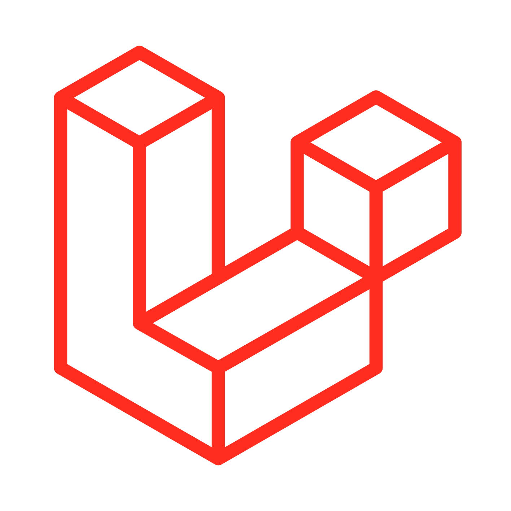

# Hello everyone 

I'm Hans, a Laravel back-end developer for over 5 years. I mostly work with the Laravel framework and contribute to the Open-source projects. You can see some of my contributions here:

###  laravel/framework
- https://github.com/laravel/framework/pull/48219
- https://github.com/laravel/framework/pull/48122

###  mongodb/laravel-mongodb
- https://github.com/mongodb/laravel-mongodb/pull/2653
- https://github.com/mongodb/laravel-mongodb/pull/2658
- https://github.com/mongodb/laravel-mongodb/pull/2670
- https://github.com/mongodb/laravel-mongodb/pull/2688
- https://github.com/mongodb/laravel-mongodb/pull/2690
[See all 19 PRs](https://github.com/mongodb/laravel-mongodb/pulls?q=is%3Apr+author%3Ahans-thomas)

###  rectorphp/rector-src
- https://github.com/rectorphp/rector-src/pull/6432

###  RonasIT/laravel-swagger
- https://github.com/RonasIT/laravel-swagger/pull/146

As it's obvious, I'm interested in contributing to open-source projects. So, if you need a hand, call me🤙.

## My skills 

## My works
In my free time, I enjoy creating and developing packages. I pinned some of my packages on my profile and I will be glad if you take a look and support me with a .

  

