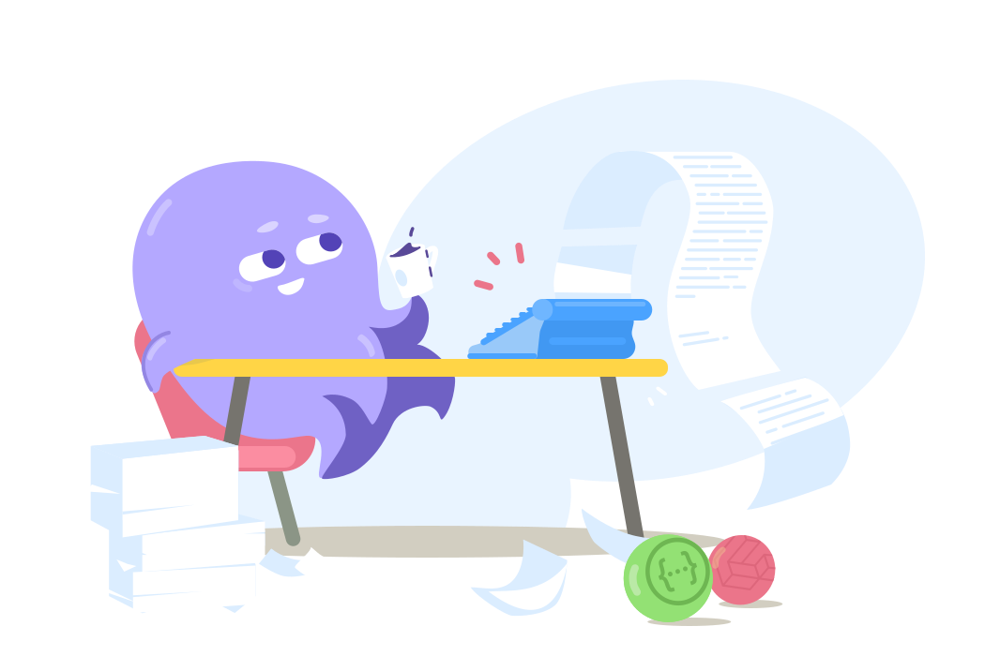

# Hello everyone 

I’m Mortazavi, and I have a passion for coding with PHP and the Laravel framework. I am eager to develop my skills and pursue a career in back-end development. Additionally, I enjoy contributing to open-source projects, so feel free to check out some of my contributions in the PRs section!

Lately, I’ve dived into C++ and the Qt framework to expand my skill set, and I’m excited to learn more. I look forward to connecting with you all!😉

## My PRs 

###  laravel/framework
- https://github.com/laravel/framework/pull/48219
- https://github.com/laravel/framework/pull/48122

###  mongodb/laravel-mongodb
- https://github.com/mongodb/laravel-mongodb/pull/2653
- https://github.com/mongodb/laravel-mongodb/pull/2658
- https://github.com/mongodb/laravel-mongodb/pull/2670
- https://github.com/mongodb/laravel-mongodb/pull/2688
- https://github.com/mongodb/laravel-mongodb/pull/2690

[See all 19 PRs](https://github.com/mongodb/laravel-mongodb/pulls?q=is%3Apr+author%3Ahans-thomas)

###  rectorphp organization
- https://github.com/rectorphp/rector-src/pull/6432
- https://github.com/rectorphp/rector-phpunit/pull/437
- https://github.com/rectorphp/rector-phpunit/pull/454
- https://github.com/driftingly/rector-laravel/pull/294

###  RonasIT/laravel-swagger
- https://github.com/RonasIT/laravel-swagger/pull/146
- https://github.com/RonasIT/laravel-swagger/pull/150
- https://github.com/RonasIT/laravel-swagger/pull/152
- https://github.com/RonasIT/laravel-swagger/pull/153

As it's obvious, I'm interested in contributing to open-source projects. So, if you need a hand, call me🤙

## My skills 

## My works
In my free time, I enjoy developing packages. I pinned some of my packages on my profile, and I will be glad if you take a look and support me with a 

  

